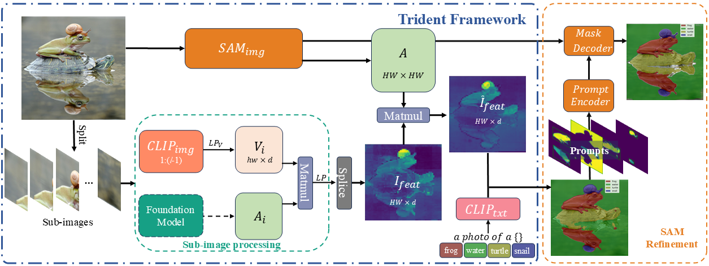
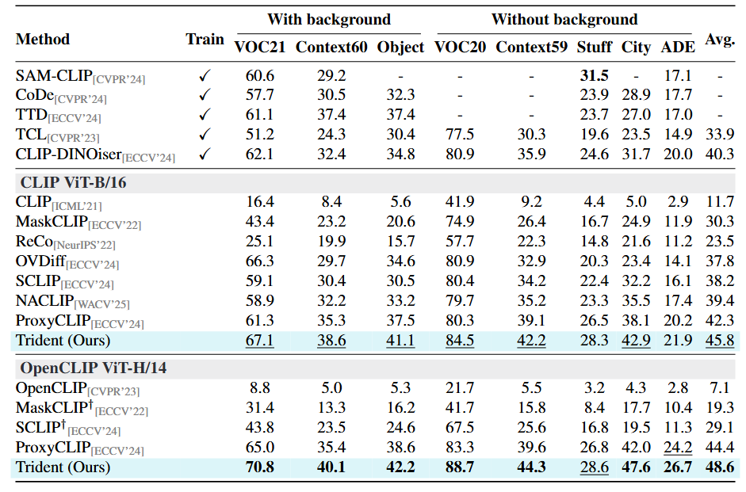
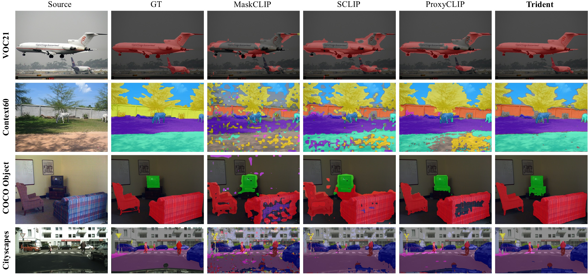

<div align="center">
<h1>Trident </h1>
<h3>Harnessing Vision Foundation Models for High-Performance, Training-Free Open Vocabulary Segmentation</h3>


([arXiv:2411.09219](https://arxiv.org/abs/2411.09219))
</div>

[](https://paperswithcode.com/sota/unsupervised-semantic-segmentation-with-4?p=harnessing-vision-foundation-models-for-high)
[](https://paperswithcode.com/sota/unsupervised-semantic-segmentation-with-3?p=harnessing-vision-foundation-models-for-high)
[](https://paperswithcode.com/sota/unsupervised-semantic-segmentation-with-10?p=harnessing-vision-foundation-models-for-high)
[](https://paperswithcode.com/sota/unsupervised-semantic-segmentation-with-9?p=harnessing-vision-foundation-models-for-high)
[](https://paperswithcode.com/sota/unsupervised-semantic-segmentation-with-8?p=harnessing-vision-foundation-models-for-high)
[](https://paperswithcode.com/sota/unsupervised-semantic-segmentation-with-12?p=harnessing-vision-foundation-models-for-high)
[](https://paperswithcode.com/sota/unsupervised-semantic-segmentation-with-11?p=harnessing-vision-foundation-models-for-high)
[](https://paperswithcode.com/sota/unsupervised-semantic-segmentation-with-7?p=harnessing-vision-foundation-models-for-high)

## News
* **` Nov. 15th, 2024`**: We release paper and code for Trident.

## Introduction
While CLIP has advanced open-vocabulary predictions, its performance on semantic segmentation remains suboptimal. 
This shortfall primarily stems from its noisy semantic features and constrained resolution. 
While previous adaptations addressed noisy semantic, the issue of limited resolution remains unexplored. 
To alleviate this issue, we introduce Trident, a training-free framework that first splices features extracted by CLIP and DINO from sub-images, then leverages SAM's encoder to create a correlation matrix for global aggregation.
This repository contains the code for Trident on eight popular benchmarks.
For more information, please refer to our [paper](https://arxiv.org/abs/2411.09219).

<p align="center">
  
</p>

## Main Results

<p align="center">
  
</p>

<p align="center">
  
</p>

## Getting Started
### Installation

**Step 1: Clone Trident repository:**

```bash
git clone https://github.com/YuHengsss/Trident.git
cd Trident
```

**Step 2: Environment Setup:**

***Create and activate a new conda environment***

```bash
conda create -n Trident
conda activate Trident
```

***Install Dependencies***


```bash
pip install -r requirements.txt
```

### Quick Start

#### Datasets Preparation

Please follow the [MMSeg data preparation document](https://github.com/open-mmlab/mmsegmentation/blob/main/docs/en/user_guides/2_dataset_prepare.md) to download and pre-process the datasets including PASCAL VOC, PASCAL Context, Cityscapes, ADE20k, COCO Object and COCO-Stuff164k.
We provide some dataset processing scripts in the `process_dataset.sh`.


####  Evaluation

Before evaluating the model, you need to download the SAM checkpoints by the link provided in [SAM's repo](https://github.com/facebookresearch/segment-anything). Besides, please modify some settings in `configs/base_config.py` and corresponding dataset configuration files like the `data_root` and `sam_ckpt`.
Then you may eval specific dataset by:

```bash
python eval.py --config ./config/cfg_DATASET.py --workdir YOUR_WORK_DIR --sam_refine
```

or eval on all datasets:
```bash
python eval_all.py
```
Results are listed in `YOUR_WORK_DIR/results.txt`.

#### Demo

By configuring the `img_path`, `name_list` and `sam_checkpoint` in `trident_demo.py`, you may run demo directly by:

```bash
python trident_demo.py
```


## Citation

If Trident is helpful for your research, please cite the following paper:

```
@article{shi2024vssd,
    title={Harnessing Vision Foundation Models for High-Performance, Training-Free Open Vocabulary Segmentation},
    author={Yuheng Shi and Minjing Dong and Chang Xu},
    journal={arXiv preprint arXiv:2411.09219},
    year={2024},
}
```

## Acknowledgment

This project is based on [SAM](https://github.com/facebookresearch/segment-anything), [ProxyCLIP](https://github.com/mc-lan/ProxyCLIP), [SCLIP](https://github.com/wangf3014/SCLIP) and [OpenCLIP](https://github.com/mlfoundations/open_clip). Thanks for their excellent works.
